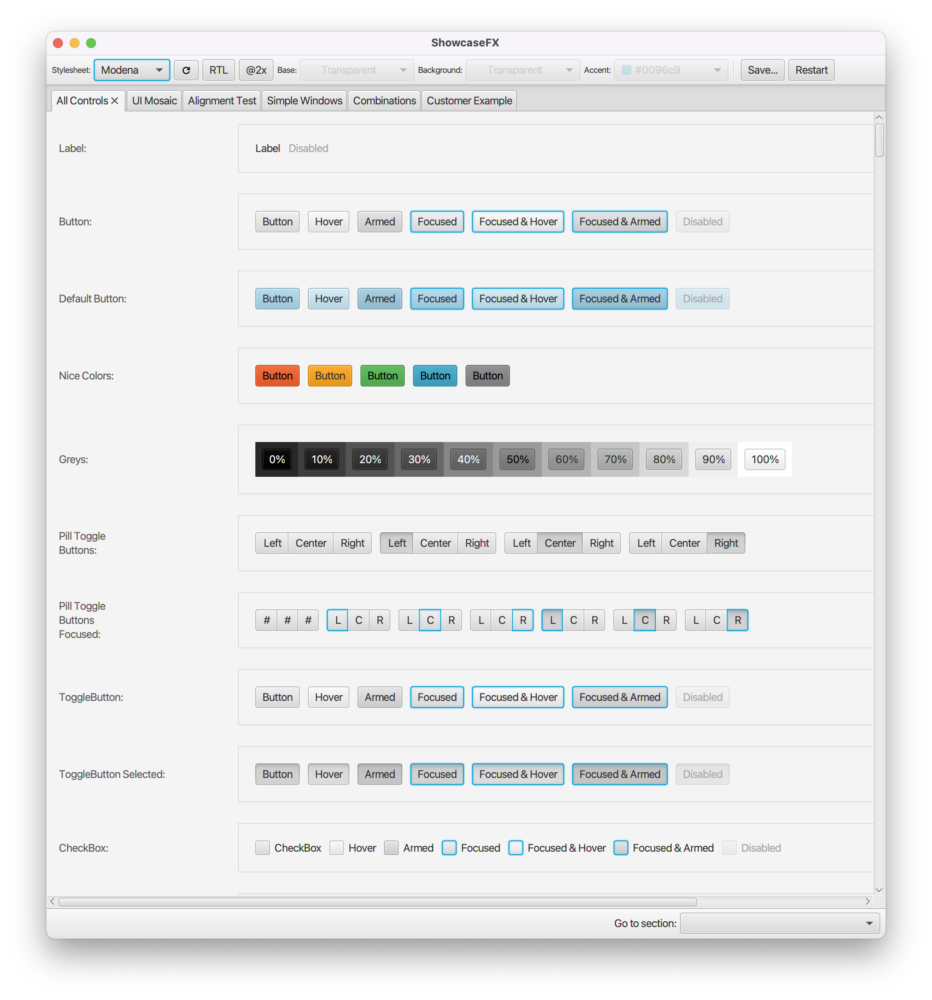

# ShowcaseFX

*At least **JDK 11** is required.*

[](https://search.maven.org/search?q=g:com.dlsc.showcasefx%20AND%20a:showcasefx)

This project contains a standalone application and an embeddable control that can be used to preview the results produced by stylesheets.

### Standalone

The main application is com.dlsc.showcase.ShowcaseApp

### Embeddable ShowcasePane

```java
StylesheetEntry entry = new StylesheetEntry("My Style", "url/to/stylesheet.css");

ShowcasePane pane = new ShowcasePane();
pane.getAvailableStylesheets().add(entry);
pane.setSelectedStylesheet(entry);

// then add pane to your UI
```

